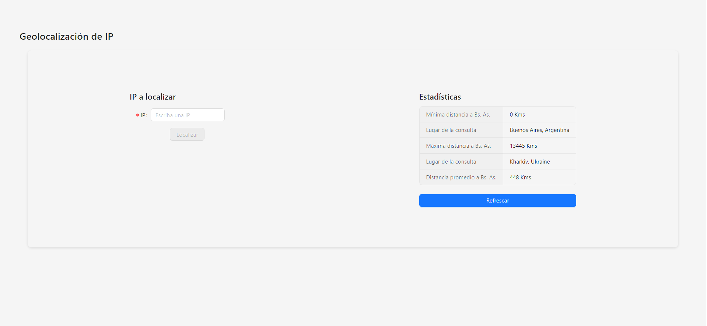
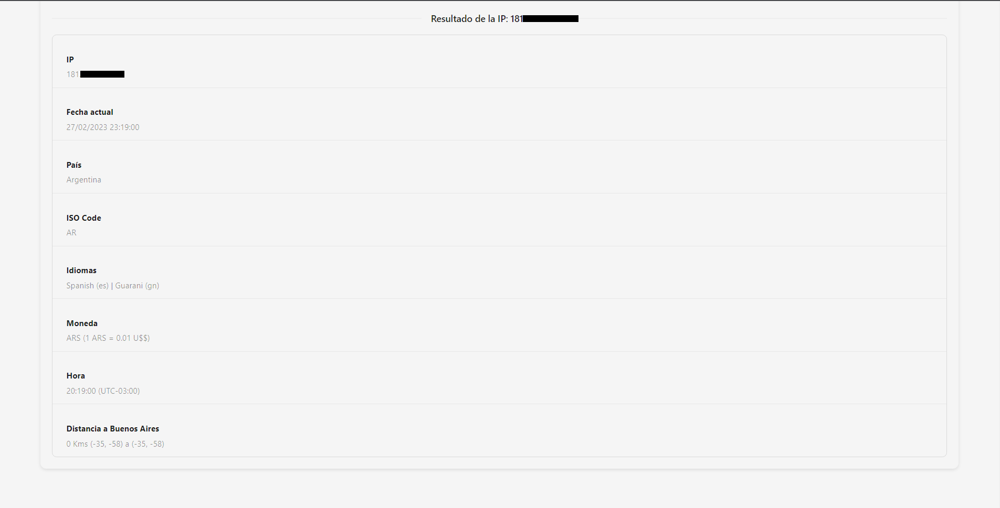

# Geolocalización de IP

## Tecnologías usadas

* Backend-end: Node.js + Express
* Front-end: Vite + React + Antd
* Base de datos: Postgre SQL
* Cache: Redis

## FOTOS




## Instrucciones de instalación y ejecución

* Instalar Docker -> https://www.docker.com/
* Clonar el Respositorio.
* En la Raiz del Proyecto usar el comando `cp .env.example .env` y completar las KEYs de las APIs.
* Usar el comando `docker-compose up`, esperar que termine de levantar los servicios correspondientes.
* El FRONT-END estara corriendo en -> http://localhost:9999/

## Respuesta de la API

```
(GET) /api/:ip/ -- ip por parametro
(POST) /api/ip/ -- ip por body (JSON)
* Description: Enviando una dirección IP devuelve los siguientes datos
* Response:
  {
    "ip": String,
    "currentDate": String,
    "country": String,
    "isoCode": String,
    "languages": String,
    "currency": String,
    "zoneTimes": String,
    "distanceEstimated": String
  }

(GET) /api
* Description: Devuelve estadísticas del uso del servicio
* Response:
  {
    "average_distance": String,
    "max_distance": String,
    "min_distance": String,
    "max_locale": String,
    "min_locale": String
  }

```

## APIS Externas usadas para el Servicio

* Geolocalización: https://ip2country.info/
* Información Extra de Paises: https://restcountries.com/#api-endpoints-v3-all
* Conversión de monedas: http://fixer.io/